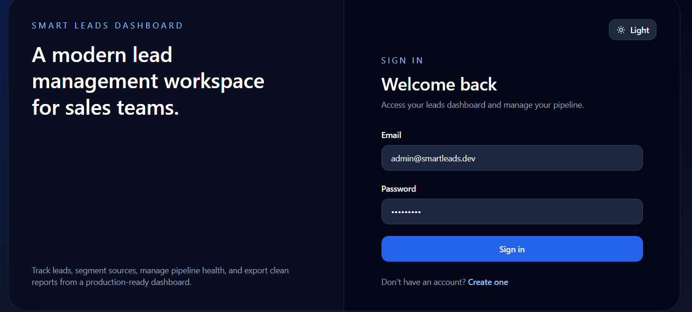
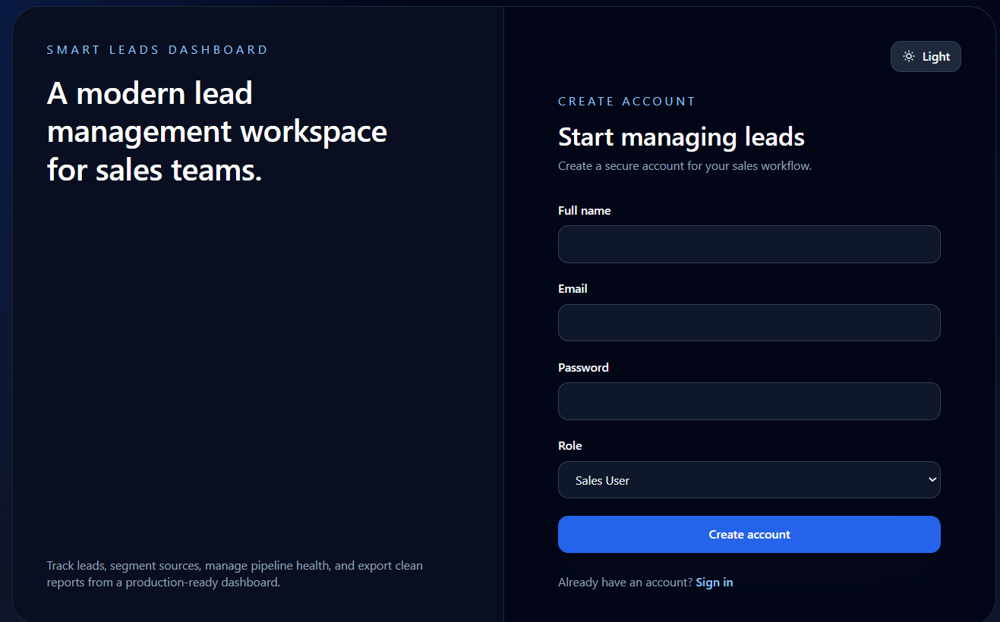
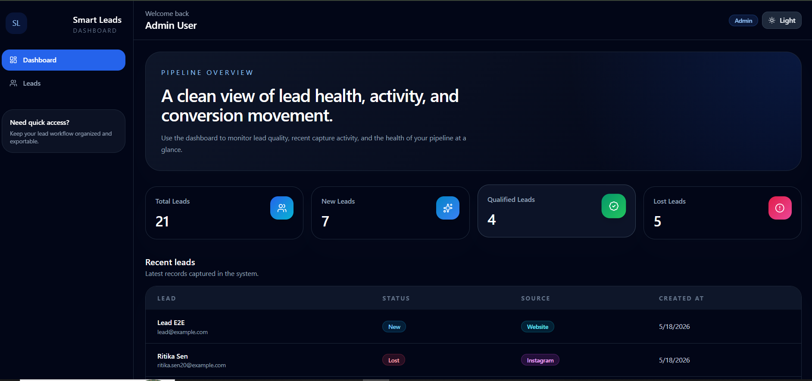
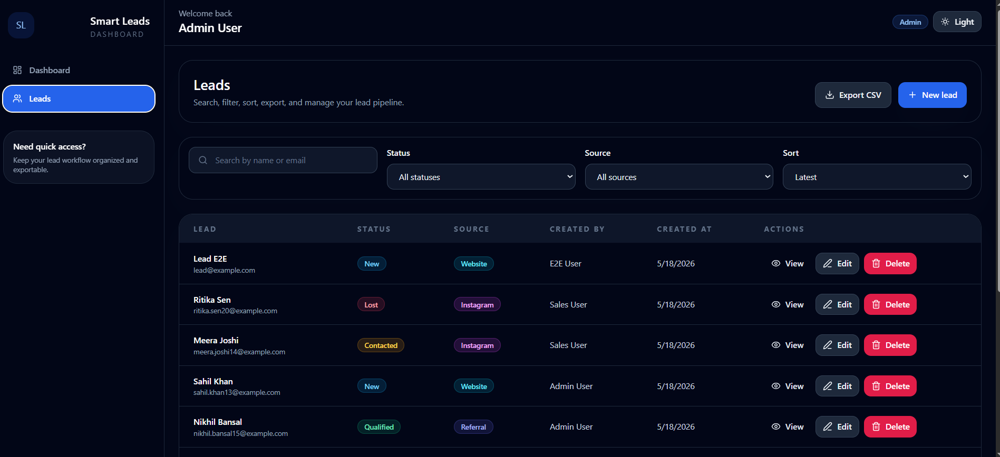
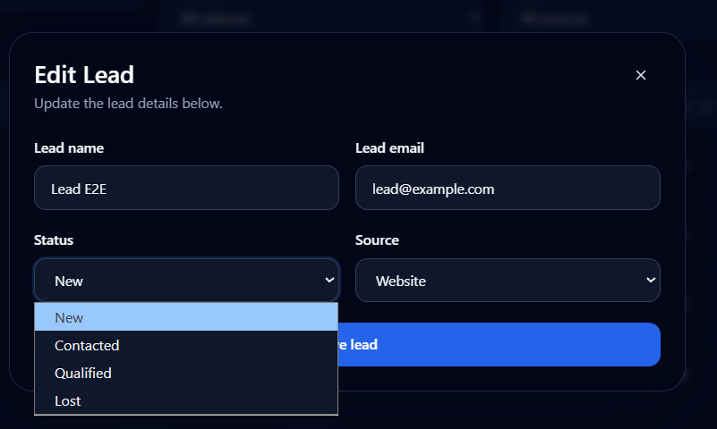
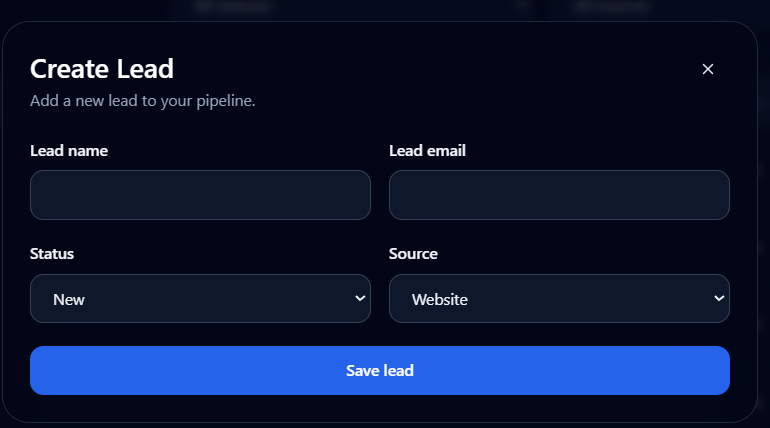
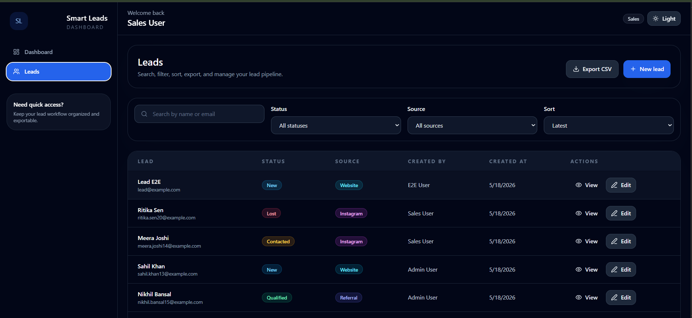
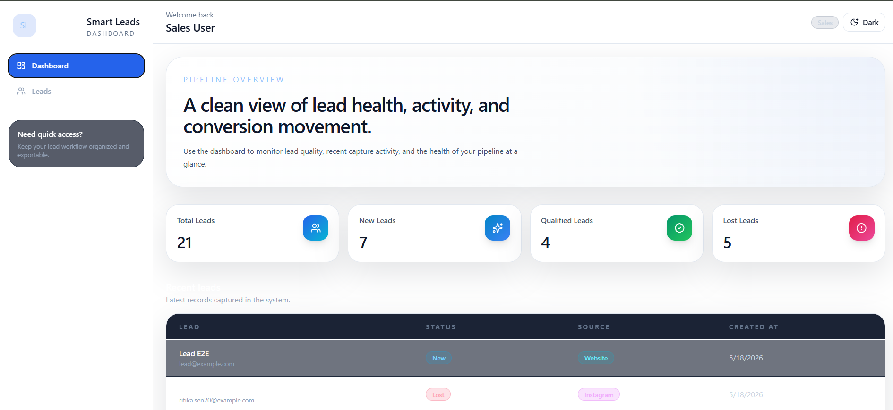

# Smart Leads Dashboard

Smart Leads Dashboard is a production-oriented MERN application for managing and tracking sales leads with strict TypeScript on both the client and server. The project is structured as a clean monorepo with reusable UI components, centralized API utilities, role-based access control, and Docker support for local and production-style workflows.

## Preview



## Live Demo

Frontend:
https://gig-flow-smart-leads-dashboard-clie.vercel.app/

Backend API:
https://gigflow-smart-leads-dashboard-v4oy.onrender.com

## Features

- JWT authentication with secure register, login, and session restoration
- Role-based access control for `admin` and `sales`
- Lead CRUD with filtering, search, sorting, and pagination
- Debounced search on the frontend
- CSV export for the currently filtered lead set
- Dashboard statistics and recent lead activity
- Professional responsive UI with reusable components
- Optional persisted dark mode
- Centralized backend validation and error handling
- Dockerized client, server, and MongoDB setup
- Seed script for demo users and leads

## Key Highlights

- Strict TypeScript architecture
- JWT Authentication & RBAC
- Advanced filtering with combined queries
- Debounced search
- CSV Export
- Responsive dashboard UI
- Dark mode support
- Dockerized monorepo setup

## Role-Based Access Control

The application implements role-based access control with admin-only deletion permissions and protected authenticated routes.

### Admin

- Can register and log in
- Can view dashboard stats
- Can view all leads and lead details
- Can create new leads
- Can edit existing leads
- Can export leads to CSV
- Can delete leads

### Sales User

- Can register and log in
- Can view dashboard stats
- Can view all leads and lead details
- Can create new leads
- Can edit existing leads
- Can export leads to CSV
- Cannot delete leads

### Important note

- The current registration form allows selecting either `admin` or `sales` during signup.
- If you want stricter production RBAC, admin creation should be restricted to trusted setup or an admin-only flow.

## Screenshots

### Dashboard overview


### Screenshots

<table>
  <tr>
    <td></td>
    <td></td>
  </tr>
  <tr>
    <td></td>
    <td></td>
  </tr>
  <tr>
    <td></td>
    <td></td>
  </tr>
  <tr>
    <td></td>
    <td></td>
  </tr>
</table>

## Tech Stack

### Frontend

- React
- TypeScript
- Vite
- TailwindCSS
- React Router DOM
- Zustand
- Axios
- React Hook Form
- Zod
- Lucide React
- React Hot Toast

### Backend

- Node.js
- Express.js
- TypeScript
- MongoDB
- Mongoose
- JWT
- bcryptjs
- Zod

## Architecture

### Client structure

```text
client/src/
  api/
  components/
    common/
    forms/
    leads/
    layout/
  hooks/
  layouts/
  pages/
    auth/
    dashboard/
  routes/
  store/
  types/
  utils/
```

### Server structure

```text
server/src/
  config/
  controllers/
  interfaces/
  middleware/
  models/
  routes/
  seed/
  services/
  utils/
  validators/
```

### Architecture Flow

Frontend (React + Zustand)
  ↓
REST API (Express + TypeScript)
  ↓
MongoDB Atlas

### Architecture Decisions

- `Zustand` was chosen for lightweight and scalable state management across the client.
- `Zod` provides runtime schema validation and improves type-safety for forms and API contracts.
- `Docker` ensures consistent development and production environments across the monorepo.
- The backend follows a layered architecture (controllers → services → models) for clarity and maintainability.

## Setup

### Prerequisites

- Node.js 20 or newer
- MongoDB Atlas or local MongoDB
- npm 10+

### Install dependencies

```bash
npm install
```

### Configure environment variables

Copy the example env file and update the values:

```bash
copy .env.example .env
```

Server variables:

- `PORT`
- `MONGODB_URI`
- `JWT_SECRET`
- `JWT_EXPIRES_IN`
- `CORS_ORIGIN`

Client variables:

- `VITE_API_BASE_URL`

### Run locally

Start both apps from the root workspace:

```bash
npm run dev
```

Run them separately if needed:

```bash
npm run dev --workspace server
npm run dev --workspace client
```

### Local URLs

- **Frontend (Vite dev):** http://localhost:5173
- **Backend (Express dev):** http://localhost:5000

When running with Docker Compose the frontend is available at `http://localhost:3000` and the backend at `http://localhost:5000`.

### Seed demo data

Seed the database with demo users and 20 leads:

```bash
npm run seed --workspace server
```

Demo credentials:

- Admin: `admin@smartleads.dev` / `Admin1234`
- Sales: `sales@smartleads.dev` / `Sales1234`

## Docker Setup

Run the full stack with MongoDB using Docker Compose:

```bash
docker compose up --build
```

Ports:

- Client: `http://localhost:3000`
- Server: `http://localhost:5000`
- MongoDB: `mongodb://localhost:27017`

## API Documentation

See [docs/API.md](docs/API.md) for endpoint details, query parameters, pagination format, and RBAC notes.

Highlights:

- `POST /api/auth/register`
- `POST /api/auth/login`
- `GET /api/auth/me`
- `GET /api/leads`
- `GET /api/leads/:id`
- `POST /api/leads`
- `PUT /api/leads/:id`
- `DELETE /api/leads/:id`
- `GET /api/dashboard/stats`

## Deployment

### Deployed URLs

- **Frontend (Vercel):** https://gig-flow-smart-leads-dashboard-clie.vercel.app/
- **Backend (Render):** https://gigflow-smart-leads-dashboard-v4oy.onrender.com


### Frontend on Vercel

- Set `VITE_API_BASE_URL` to the deployed backend URL including `/api`, for example `https://your-backend.onrender.com/api`.
- Ensure the build command is `npm run build --workspace client` if deploying from the monorepo root.

### Backend on Render

- Set `MONGODB_URI`, `JWT_SECRET`, `JWT_EXPIRES_IN`, and `CORS_ORIGIN`.
- Point `CORS_ORIGIN` to the exact deployed frontend URL with no trailing slash, for example `https://your-frontend.vercel.app`.
- Use `npm run build --workspace server` for the build step and `npm run start --workspace server` for runtime.

### Database on MongoDB Atlas

- Use the Atlas connection string in `MONGODB_URI`.
- Keep the database credentials out of source control.

## Demo Video

- Watch the demo video: https://drive.google.com/file/d/1vqih_60_zeV5Ezza7iB1jCkhc6tGwHmE/view?usp=sharing

## Implementation Notes

- The frontend uses Zustand for auth, lead, and UI state.
- The backend keeps auth, leads, dashboard stats, and validation in separate layers.
- Error messages are normalized through shared API helpers on the client.
- The dashboard and leads views include loading, empty, and error states rather than rendering blank surfaces.

## License

This project is prepared as an internship submission and does not include a separate open-source license.
